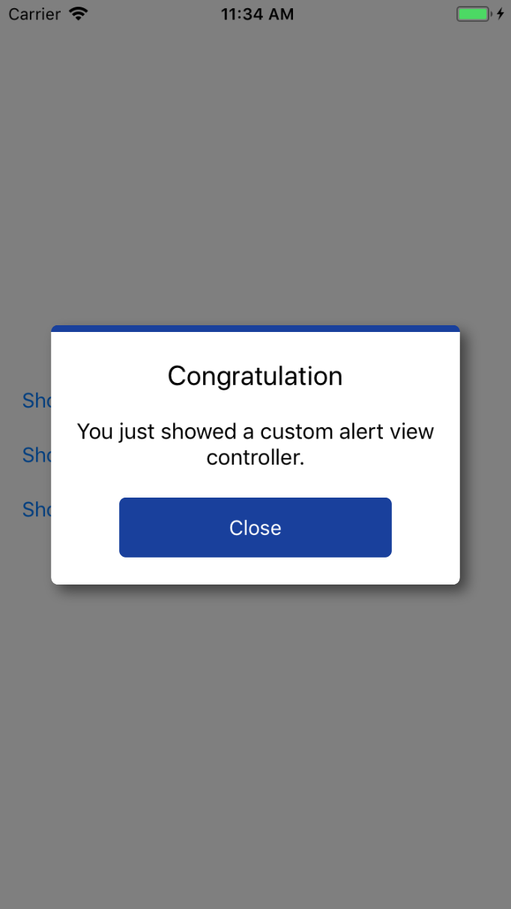
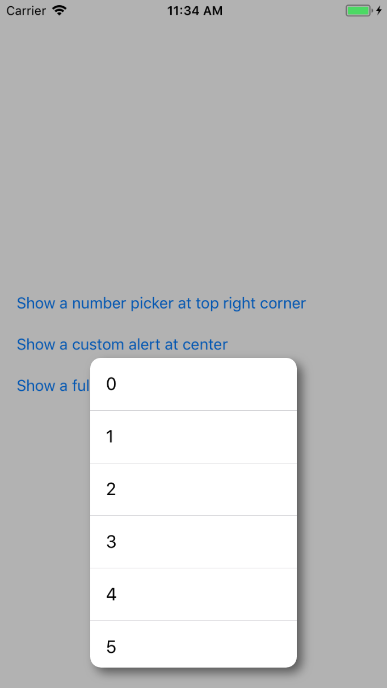

# EzPopup

[](https://cocoapods.org/pods/EzPopup)
[](https://cocoapods.org/pods/EzPopup)
[](https://cocoapods.org/pods/EzPopup)

## What is EzPopup
If you are struggling in finding a way to show a view or view controller as a pop up on your iOS devices, this pod is for you. With EzPopup, you can show popup easily, like below:




## Example

To run the example project, clone the repo, and run `pod install` from the Example directory first.

## Compatibility
- iOS 13 and later.
- Swift 5.1 and later (for earlier Swift version, please use earlier `ImageScrollView` version).

## Installation

### Swift Package Manager
```swift
dependencies: [
    .package(url: "https://github.com/huynguyencong/EzPopup.git", .upToNextMajor(from: "1.0.0"))
]
```

Or

File > Swift Packages > Add Package Dependency
Add https://github.com/huynguyencong/EzPopup.git
Select "Up to Next Major" with "1.0.0"

### Cocoapods

EzPopup is available through [CocoaPods](https://cocoapods.org). To install
it, simply add the following line to your Podfile:

```ruby
pod 'EzPopup'
```

## Usage
Using pop up view controller is very simple:

Firstly, init a `PopupViewController` with a view or view controller you want to show:

```swift
// init YourViewController
let contentViewController = ...

// Init popup view controller with content is your content view controller. 
// You can let your content view determine pop up size by using its intrinsic size by setting popupWidth and popupHeight nil.
// You can also set position by the position param. If you want show a pop up below a view, use .offsetFromView for position param.
let popupVC = PopupViewController(contentController: contentViewController, popupWidth: 100, popupHeight: 200)

// show it by call present(_ , animated:) method from a current UIViewController
present(popupVC, animated: true)
```

Optional: You can custom some properties of `PopupViewController` if you'd like. For example:

```swift
popupVC.backgroundAlpha = 0.3
popupVC.backgroundColor = .black
popupVC.canTapOutsideToDismiss = true
popupVC.cornerRadius = 10
popupVC.shadowEnabled = true
```

## SwiftUI version
[SwiftUI Popup](https://github.com/huynguyencong/ToastSwiftUI)

## Author

huynguyencong, conghuy2012@gmail.com

## License

EzPopup is available under the MIT license. See the LICENSE file for more info.
